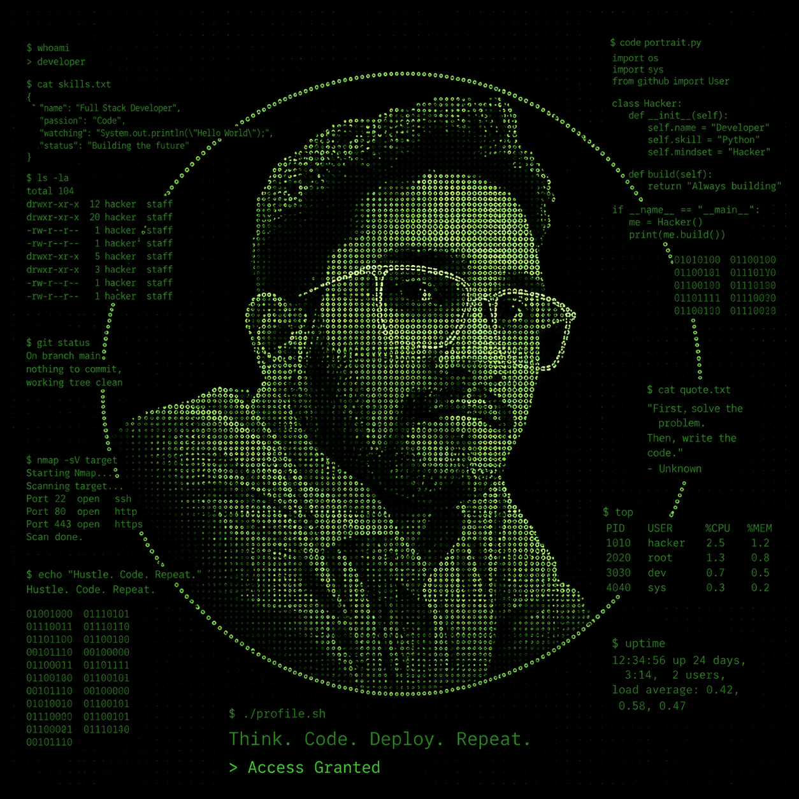

  

<h1 align="center">Sunrit Biswas</h1>
<h3 align="center">Systems & AI builder · India-first products · Open source</h3>

  
  
  
  
  

  
  
  
  
  
  

---

## Featured projects

### Full-stack & SaaS

| Project | Description | Links |
| --- | --- | --- |
| **UniBot Ops** | Production-ready multi-tenant WhatsApp bot SaaS — NestJS + Prisma + BullMQ API with Argon2/JWT auth & RBAC, state-machine chatbot flows, bookings with slot checks & smart reminders, broadcasts, CRM, analytics, onboarding wizard and a Next.js dashboard. Fully containerized with Docker CI/CD (auto images to GHCR). | [Repo](https://github.com/Sunrit-dev/unibot-ops) · [CI](https://github.com/Sunrit-dev/unibot-ops/actions) |
| **BinIt** | AI-powered geospatial civic waste management platform — photo reports, 11-class computer-vision waste classification, severity scoring, OSRM collection routing, dual urban/panchayat zones & proof-of-cleanup verification. Next.js 14 + FastAPI. | [Repo](https://github.com/Sunrit-dev/BinIt) · [Live](https://binit-sigma.vercel.app/) |

### Systems & graphics

| Project | Description | Links |
| --- | --- | --- |
| **JUnE OS** | AI-integrated Rust OS — graphical desktop, window manager, 5 apps, ring-3 user mode, persistent DB | [Repo](https://github.com/Sunrit-dev/juneos-os) · [Release](https://github.com/Sunrit-dev/juneos-os/releases) · [Package](https://github.com/Sunrit-dev/juneos-os/pkgs/container/juneos-os) |
| **AetherTrace** | Physically-based path tracer in Rust — NEE + MIS, BVH, GGX PBR, progressive rendering | [Repo](https://github.com/Sunrit-dev/aethertrace) |

### AI for India

| Project | Description | Links |
| --- | --- | --- |
| **BharatGov AI** | AI assistant for Indian government services with official-source citations | [Repo](https://github.com/Sunrit-dev/bharatgov-ai) · [Live](https://bharatgov-ai-phi.vercel.app) |
| **Nyaya AI** | Legal document explainer in English, Hindi & Bengali — 13 Indian laws | [Repo](https://github.com/Sunrit-dev/ai-legal-assistant) · [Live](https://Sunrit-dev.github.io/ai-legal-assistant/) |
| **SmartCity AI** | Civic complaint platform — AI classification, multilingual assistant, live maps | [Repo](https://github.com/Sunrit-dev/smartcity-ai) |
| **ThirdJune** | Sovereign AI agent platform — 8 agents, encryption, sandboxed code execution | [Repo](https://github.com/Sunrit-dev/thirdjune-ai) |
| **ThirdJune Workspace** | One AI workspace for documents — writing, PDFs, spreadsheets, presentations | [Repo](https://github.com/Sunrit-dev/One-Al-workspace-for-every-document.) |

### Games & tools

| Project | Description | Links |
| --- | --- | --- |
| **June Gun Game** | Browser FPS — ballistics, recoil, procedural audio, Indian-style NPCs & festival arena | [Play](https://Sunrit-dev.github.io/june-gun-game/) · [Repo](https://github.com/Sunrit-dev/june-gun-game) |
| **NimbusBT** | Modern BitTorrent client — web UI, CLI, SOCKS proxy, blocklist | [Repo](https://github.com/Sunrit-dev/nimbusbt) |

### Developer tools

| Project | Description | Links |
| --- | --- | --- |
| **gitglow** | Premium local Git contribution heatmap in Go. Truecolor `█` graph, a Streaks & Records panel (current/longest streak, best day, busiest week, active-day %), 4 themes (dark / light / synthwave / ice), flexible ranges (30d · 3m · 6m · 1y · all), HTML dashboard export, and cross-platform releases. | [Repo](https://github.com/Sunrit-dev/gitglow) · [Releases](https://github.com/Sunrit-dev/gitglow/releases) · [CI](https://github.com/Sunrit-dev/gitglow/actions/workflows/ci.yml) |

---

## Languages

| Language | Share |
| --- | --- |
| TypeScript | ██████████·········· 52.2% |
| Python | █████··············· 22.9% |
| JavaScript | ██·················· 11.3% |
| Rust | ██·················· 8.8% |
| CSS | ······················ 2.1% |
| Go | ······················ 1.1% |
| Java | ······················ 0.7% |
| HTML | ······················ 0.5% |
| Shell | ······················ 0.2% |
| Dockerfile | ······················ 0.2% |
| Linker Script | ······················ 0.1% |
| Procfile | ······················ 0.0% |

---

## Quick links

| | |
| --- | --- |
| **Repositories** | [github.com/Sunrit-dev?tab=repositories](https://github.com/Sunrit-dev?tab=repositories) |
| **Releases** | [github.com/Sunrit-dev?tab=repositories&q=has%3Arelease](https://github.com/Sunrit-dev?tab=repositories&q=has%3Arelease) |
| **Packages** | [github.com/Sunrit-dev?tab=packages](https://github.com/Sunrit-dev?tab=packages) |
| **Gists** | [gist.github.com/Sunrit-dev](https://gist.github.com/Sunrit-dev) |
| **Stories** | [medium.com/@sunofficial39](https://medium.com/@sunofficial39) |

---

<strong>Open to collaborations · hackathons · startup ideas</strong>

Telegram <a href="https://t.me/sunritbiswas">@sunritbiswas</a> · Email <a href="mailto:sunritbiswas9@gmail.com">sunritbiswas9@gmail.com</a>

