  

  

<h1 align="center">Sunrit Biswas</h1>
<h3 align="center">Software &amp; AI Engineer · India-first products · Open Source</h3>

  
  
  
  
  
  

  
  

---

## 👋 About Me

**Software & AI Engineer**, building products end to end — from systems programming to deployed AI applications.

I architect and ship full-stack products with clean code: high-performance **systems & web backends** (Rust, Python, TypeScript), scalable **cloud infrastructure** (Docker, CI/CD), and production-grade **software architecture** (auth, RBAC, queues, payments). On the AI side, I design and integrate **LLM-powered applications** — agent systems, RAG with grounded citations, and computer vision — engineered for reliability and real-world use.

> 💼 Open to roles and collaborations in **software engineering, AI products, and systems engineering**.

---

## 🚀 Tech Stack

### 💻 Languages

### 🖥️ Frontend

### ⚙️ Backend

### 🗄️ Databases & Storage

### 📱 Mobile & Cross-Platform

### ☁️ Cloud, DevOps & Systems

### 🤖 AI / ML / LLMs

### 🎨 Creative & Design Tools

---

## ⭐ Featured Projects

### Full-stack & SaaS

| Project | Description | Links |
| --- | --- | --- |
| **UniBot Ops** | Production-ready multi-tenant WhatsApp bot SaaS — NestJS + Prisma + BullMQ API with Argon2/JWT auth & RBAC, state-machine chatbot flows, bookings, broadcasts, CRM, analytics and a Next.js dashboard. Docker CI/CD to GHCR. | [Repo](https://github.com/Sunrit-dev/unibot-ops) · [CI](https://github.com/Sunrit-dev/unibot-ops/actions) |
| **BinIt** | AI-powered geospatial civic waste management platform — photo reports, 11-class computer-vision waste classification, severity scoring, OSRM collection routing, dual urban/panchayat zones & proof-of-cleanup. Next.js 14 + FastAPI. | [Repo](https://github.com/Sunrit-dev/BinIt) · [Live](https://binit-sigma.vercel.app/) |
| **SmartCity AI** | AI-powered civic complaint management platform — AI classification, multilingual assistant, live maps. FastAPI + Next.js 15. | [Repo](https://github.com/Sunrit-dev/smartcity-ai) |

### AI for India

| Project | Description | Links |
| --- | --- | --- |
| **BharatGov AI** | AI assistant for Indian government services with official-source citations — Next.js + FastAPI + Gemini/OpenAI RAG. | [Repo](https://github.com/Sunrit-dev/bharatgov-ai) · [Live](https://bharatgov-ai-phi.vercel.app) |
| **Nyaya AI** | AI legal assistant for India — explains FIRs, agreements & court orders in English, Hindi & Bengali with risk flags, deadlines & next steps. Paid SaaS with UPI payments. | [Repo](https://github.com/Sunrit-dev/ai-legal-assistant) · [Live](https://Sunrit-dev.github.io/ai-legal-assistant/) |
| **One AI Workspace** | One workspace for every document — AI writing, PDFs, spreadsheets, presentations & media conversion in a single suite. | [Repo](https://github.com/Sunrit-dev/One-Al-workspace-for-every-document.) |
| **ThirdJune** | Sovereign AI agent platform — 8 agents, encryption, sandboxed code execution. | [Repo](https://github.com/Sunrit-dev/thirdjune-ai) |

### Systems & graphics

| Project | Description | Links |
| --- | --- | --- |
| **JUnE OS** | AI-integrated Rust operating system — boots a graphical Ubuntu-style desktop, window manager, 5 apps, ring-3 user mode & persistent on-disk DB. | [Repo](https://github.com/Sunrit-dev/juneos-os) · [Release](https://github.com/Sunrit-dev/juneos-os/releases) · [Package](https://github.com/Sunrit-dev/juneos-os/pkgs/container/juneos-os) |
| **AetherTrace** | Physically-based path tracer in Rust — NEE + MIS, binned-SAH BVH, GGX PBR, dielectrics, HDR sky & progressive multi-threaded rendering. | [Repo](https://github.com/Sunrit-dev/aethertrace) |
| **Forage Midas** | JPMorgan Chase Advanced Software Engineering job simulation — real-world trading-system engineering. | [Repo](https://github.com/Sunrit-dev/forage-midas) |

### Games & tools

| Project | Description | Links |
| --- | --- | --- |
| **June Gun Game** | Browser FPS — ballistics, recoil, layered procedural audio, Indian-style NPCs & festival arena (Three.js/WebGL). | [Play](https://Sunrit-dev.github.io/june-gun-game/) · [Repo](https://github.com/Sunrit-dev/june-gun-game) |
| **NimbusBT** | Modern, secure, open-source BitTorrent client — native-style web UI, CLI, SOCKS5 proxy & blocklist (WebTorrent). | [Repo](https://github.com/Sunrit-dev/nimbusbt) |
| **gitglow** | Premium local Git contribution heatmap in Go — truecolor graph, streaks & records, 4 themes, HTML dashboard export. | [Repo](https://github.com/Sunrit-dev/gitglow) · [Releases](https://github.com/Sunrit-dev/gitglow/releases) |

---

## 📊 GitHub Stats

  
  

  

---

## 📈 What I Build

**Software engineering** ⚙️
- 🦀 **Systems**: OS kernels, low-level graphics, perf-critical Rust (JUnE OS, AetherTrace)
- 🌐 **Full-stack web**: Next.js + FastAPI / NestJS products with clean architecture
- 🧰 **Backend & DevOps**: NestJS, Prisma, BullMQ, Docker, GitHub Actions, GHCR, cloud deploys
- 📱 **Mobile**: cross-platform Android + iOS apps
- 🚀 **SaaS**: real auth, RBAC, queues, payments & CI/CD — not demos

**AI engineering** 🤖
- 🧠 **LLM agents & multi-agent systems** (ThirdJune)
- 📚 **RAG with citation-grounded answers** (BharatGov AI)
- 👁️ **Computer vision** — waste classification, severity scoring (BinIt)
- ⚖️ **Multilingual legal AI** — English, Hindi & Bengali (Nyaya AI)
- 🇮🇳 **Applied AI for India** — government services, civic tech, Indian languages

---

## Quick links

| | |
| --- | --- |
| **Repositories** | [github.com/Sunrit-dev?tab=repositories](https://github.com/Sunrit-dev?tab=repositories) |
| **Releases** | [github.com/Sunrit-dev?tab=repositories&q=has%3Arelease](https://github.com/Sunrit-dev?tab=repositories&q=has%3Arelease) |
| **Packages** | [github.com/Sunrit-dev?tab=packages](https://github.com/Sunrit-dev?tab=packages) |
| **Gists** | [gist.github.com/Sunrit-dev](https://gist.github.com/Sunrit-dev) |
| **Stories** | [medium.com/@sunofficial39](https://medium.com/@sunofficial39) |

---

<strong>Open to collaborations · hackathons · startup ideas · great problems 🇮🇳</strong>
